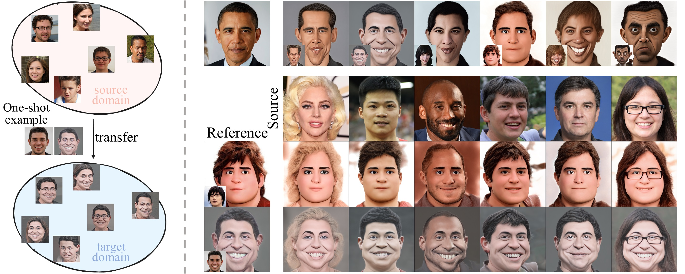
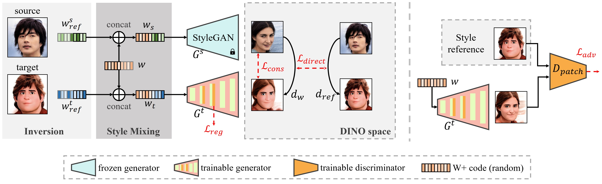
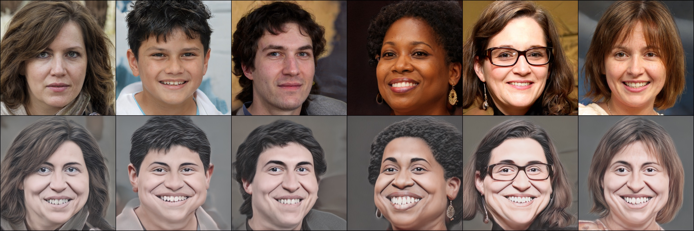
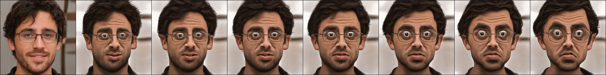

# Deformable One-shot Face Stylization via DINO Semantic Guidance


[Yang Zhou](https://zhouyangvcc.github.io/), [Zichong Chen](https://github.com/zichongc), [Hui Huang](https://vcc.tech/~huihuang)

Shenzhen University

<p>

</p>


[[project page]](https://vcc.tech/research/2024/DoesFS) [[paper]](https://arxiv.org/pdf/2403.00459.pdf) [[supplementary]](https://drive.google.com/file/d/1lkQ_ZCLovFSYiPYLvUbvv1a7vdWblCvQ/view?usp=sharing)


### Abstract
> This paper addresses the complex issue of one-shot face stylization, focusing on the simultaneous consideration of appearance and structure, where previous methods have fallen short. We explore deformation-aware face stylization that diverges from traditional single-image style reference, opting for a real-style image pair instead. The cornerstone of our method is the utilization of a self-supervised vision transformer, specifically DINO-ViT, to establish a robust and consistent facial structure representation across both real and style domains. Our stylization process begins by adapting the StyleGAN generator to be deformation-aware through the integration of spatial transformers (STN). We then introduce two innovative constraints for generator fine-tuning under the guidance of DINO semantics: i) a directional deformation loss that regulates directional vectors in DINO space, and ii) a relative structural consistency constraint based on DINO token self-similarities, ensuring diverse generation. Additionally, style-mixing is employed to align the color generation with the reference, minimizing inconsistent correspondences. This framework delivers enhanced deformability for general one-shot face stylization, achieving notable efficiency with a fine-tuning duration of approximately 10 minutes. Extensive qualitative and quantitative comparisons demonstrate the superiority of our approach over existing state-of-the-art one-shot face stylization methods.


### Overview

<p>

</p>

Given a single real-style paired reference, we fine-tune a deformation-aware generator $G_t$ that simultaneously realizes geometry deformation and appearance transfer.

## Getting started

### Requirements
We have tested on:

* Both Linux and Windows
* NVIDIA GPU + CUDA 11.6
* Python 3.9
* PyTorch 1.13.0
* torchvision 0.14.0

Install all the libraries through `pip install -r requirements.txt`

### Pretrained Models
Please download the pre-trained models from [Google Drive](https://drive.google.com/drive/folders/1niTspxYSQi62Vgqai5QEgBUcdLRwy9lw?usp=drive_link).


| Model                                                                                                                   | Description                                                                                                                                                                                                                            |
|:------------------------------------------------------------------------------------------------------------------------|:---------------------------------------------------------------------------------------------------------------------------------------------------------------------------------------------------------------------------------------|
| [StyleGANv2](https://drive.google.com/file/d/1DISPkstVLzzwZG9mZ30UtLZXvSPFzEcS/view?usp=sharing)                        | StyleGANv2 model pretrained on [FFHQ](https://github.com/NVlabs/ffhq-dataset) with 1024x1024 output resolution.                                                                                                                        |
| [e4e_ffhq_encode](https://drive.google.com/file/d/1PyGcga5TD5YNFJS2ZL8s8axBtTtsYMIF/view?usp=sharing)                   | FFHQ e4e encoder.                                                                                                                                                                                                                      |
| alexnet                                                                                                                 | Pretrained alexnet, [alex.pth](https://drive.google.com/file/d/1UYVmwrBoVHld8RM9fZdLm_VVu2muQwKW/view?usp=sharing) and [alexnet-owt-7be5be79.pth](https://drive.google.com/file/d/151fj-k03QtxODhr4b9w1ZK-xqNt595en/view?usp=sharing). |
| [shape_predictor_68_face_landmarks](https://drive.google.com/file/d/1VK_7Loo46lwq6msPbnrsQozvEdAof6kt/view?usp=sharing) | Face detector for extracting face landmarks.                                                                                                                                                                                           |
| [style1](https://drive.google.com/file/d/13UuSkYB5MG6vkg50tU1iq75VMo4oQN8U/view?usp=sharing)                            | Generator with STNs trained on one-shot paired data [source1.png](./data/style_images_aligned/source1.png) and [target1.png](./data/style_images_aligned/target1.png).                                                                 |
| [style2](https://drive.google.com/file/d/1_El9_ESWcrNLV0wDygFBvroYnpN4WSxJ/view?usp=sharing)                            | Generator with STNs trained on one-shot paired data [source2.png](./data/style_images_aligned/source2.png) and [target2.png](./data/style_images_aligned/target2.png).                                                                 |
| [style3](https://drive.google.com/file/d/13eUkbjKlJU3kAjyRrZf8HXJ6cBLA1pmf/view?usp=sharing)                            | Generator with STNs trained on one-shot paired data [source3.png](./data/style_images_aligned/source3.png) and [target3.png](./data/style_images_aligned/target3.png).                                                                 |
| [style4](https://drive.google.com/file/d/1JkGZUqkMFydW1fRkZ5ZgJBCcQOHF-Xr_/view?usp=sharing)                            | Generator with STNs trained on one-shot paired data [source4.png](./data/style_images_aligned/source4.png) and [target4.png](./data/style_images_aligned/target4.png).                                                                 |
| [style5](https://drive.google.com/file/d/165y9Y22knrkqMIu0meZn81x3Y7oLrFjN/view?usp=sharing)                            | Generator with STNs trained on one-shot paired data [source5.png](./data/style_images_aligned/source5.png) and [target5.png](./data/style_images_aligned/target5.png).                                                                 |
| [style6](https://drive.google.com/file/d/1bl7Esw3mjCiuuSMZ0mP9edqSvJeStPYE/view?usp=sharing)                            | Generator with STNs trained on one-shot paired data [source6.png](./data/style_images_aligned/source6.png) and [target6.png](./data/style_images_aligned/target6.png).                                                                 |
| [style7](https://drive.google.com/file/d/1-MB7OzSlYGoTqM0TKaLJGr38_efLEFjB/view?usp=sharing)                            | Generator with STNs trained on one-shot paired data [source7.png](./data/style_images_aligned/source7.png) and [target7.png](./data/style_images_aligned/target7.png).                                                                 |
| [style8](https://drive.google.com/file/d/1XxCHzPXbkPC7mIA08qgcjzPYqWN562xp/view?usp=sharing)                            | Generator with STNs trained on one-shot paired data [source8.png](./data/style_images_aligned/source8.png) and [target8.png](./data/style_images_aligned/target8.png).                                                                 |

By default, we assume that all models are downloaded and saved to the directory `./checkpoints`.

## Inference
Transfer the pretrained style onto a given image. Results are saved in the `./outputs/inference` folder by default.

```bash
python inference.py --style=style3 --input_image=./data/test_inputs/002.png --alpha=0.8
```

**Note:** We use pretrained e4e for input image inversion, make sure the pretrained e4e has been downloaded and placed 
to `./checkpoints`. _Although using e4e can save inference time, the final results are sometimes different from the input images._

## Generation

### Random stylized faces
Generate random face images using pretrained styles. Results are saved in the `./outputs/generate` folder by default.

```bash
python generate_samples.py --style=style1 --seed=2024 --alpha=0.8
```

<p>

</p>

### Controllable face deformation
Generate random face images using pretrained styles with deformation control of different degrees. 
Results are saved in the `./outputs/control` folder by default.

```bash
python deformation_control.py --style=style1 --alpha0=-0.5 --alpha1=1. 
```

<p>

</p>

## Train on your own style images
Prepare your (aligned) paired images as real-style samples, place them in the `./data/style_images_aligned` folder. 
Make sure the pretrained StyleGANv2 `stylegan2-ffhq-config-f.pt` and alexnet `alex.pth, alexnet-owt-7be5be79.pth` have 
been downloaded and placed to `./checkpoints`.

Start training on your own style images, run:
```bash
python train.py --style=[STYLE_NAME] --source=[REAL_IMAGE_PATH] --target=[TARGET_IMAGE_PATH] 
```

For example,
```bash
python train.py --style=style1 --source=source1.png --target=target1.png
```

**Note:** 
* If your face images are not aligned, check the face model `shape_predictor_68_face_landmarks.dat` has 
downloaded and placed to `./checkpoints`, and run the following command for face alignment:
    ```bash
    python face_align.py --path=[YOUR_IMAGE_PATH] --output=[PATH_TO_SAVE]
    ```
* DINO-ViT will be downloaded automatically. We use `dino_vitb8` in our experiments.
* The training requires ~22 GB VRAM. It averagely costs 13 mins tested on a single NVIDIA RTX 3090. 
* The trained generator will be saved in `./outputs/models`.


## Citation

```
@inproceedings{zhou2024deformable,
    title = {Deformable One-shot Face Stylization via DINO Semantic Guidance},
    author = {Yang Zhou, Zichong Chen, Hui Huang},
    booktitle = {CVPR},
    year = {2024}}
```

## Acknowledgments

The StyleGANv2 is borrowed from this [pytorch implementation](https://github.com/rosinality/stylegan2-pytorch) by [@rosinality](https://github.com/rosinality). The implementation of e4e projection is also heavily from [encoder4editing](https://github.com/omertov/encoder4editing). This code also contains submodules inspired by [Splice](https://github.com/omerbt/Splice), [few-shot-gan-adaptation](https://github.com/utkarshojha/few-shot-gan-adaptation), [tps_stn_pytorch](https://github.com/WarBean/tps_stn_pytorch).
